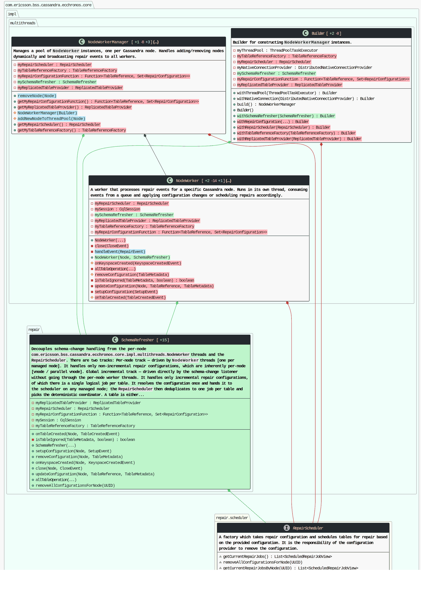

# striff-lib

**Turn a code diff into an architectural diagram.**

[](https://central.sonatype.com/artifact/io.github.hadi-technology/striff-lib) [](https://app.codacy.com/gh/hadi-technology/striff-lib/dashboard?utm_source=gh&utm_medium=referral&utm_content=&utm_campaign=Badge_grade) [](LICENSE) [](https://haditechnology.com) [](http://makeapullrequest.com)

A line-wise diff tells you which characters changed. It does not tell you that a change moved a dependency across a package boundary, or introduced a cycle, or coupled two modules that used to be independent. Reviewers reconstruct that from memory, one file at a time.

Give striff-lib two versions of a codebase and it gives you back a "striff": a diagram of the classes and relationships the change actually touched, with added, deleted, and modified components marked. Nothing else is drawn, so the picture stays small enough to read during a review.



### Getting Started

Requirements: Java 17 and Maven 3.x. No native dependencies. Diagrams render through PlantUML's pure-Java Smetana layout engine by default, so Graphviz is **not** required (install it only if you opt into `LayoutEngine.GRAPHVIZ`).

Add the dependency (check the badge above for the latest version):

```xml
<dependency>
  <groupId>io.github.hadi-technology</groupId>
  <artifactId>striff-lib</artifactId>
  <version>4.0.0</version>
</dependency>
```

Or build from source:

```bash
mvn clean package assembly:single
```

### Quickstart
Minimal example (see [`StriffAPITest`](src/test/java/striff/test/model/StriffAPITest.java) for more):

```java
import com.hadi.clarpse.compiler.ProjectFiles;
import com.hadi.striff.StriffConfig;
import com.hadi.striff.StriffOperation;
import com.hadi.striff.diagram.StriffDiagram;

import java.util.List;

ProjectFiles oldFiles = new ProjectFiles("/path/to/original/code");
ProjectFiles newFiles = new ProjectFiles("/path/to/modified/code");
List<StriffDiagram> striffs = new StriffOperation(
        oldFiles, newFiles, new StriffConfig()).result().diagrams();
for (StriffDiagram diagram : striffs) {
  String svg = diagram.svg();               // null if metadata-only
  int size = diagram.size();                // number of components
  var pkgs = diagram.containedPkgs();       // packages included
  var components = diagram.cmps();          // DiagramComponent set
  var relations = diagram.relations();      // RelationsMap
  var changeSet = diagram.changeSet();      // ChangeSet for this diff
}
```

### Configuration

#### Parsing and language support (Clarpse)
Striff uses the [Clarpse](https://github.com/hadi-technology/clarpse) parser under the hood to build the source model from your codebase.
By default every language Clarpse supports is enabled; narrow that with `StriffConfig.setLanguages(...)`.

Supported languages (via Clarpse):
* Java
* C#
* TypeScript (requires Node.js and a valid `tsconfig.json`)
* Python (requires Node.js)

Parsing failures (e.g., unsupported syntax) are reported by Clarpse and surfaced
through Striff as compile warnings on the output. Striff will still attempt to
return diagrams/metadata when possible.

#### File filters
Limit parsing and diagram generation to a specific file list:

```java
StriffConfig config = new StriffConfig()
        .setFilesFilter(List.of("/src/main/java/com/acme/Foo.java"));
```

Note: the file filter is applied to parsing, so only the filtered files are compiled
and considered for diagram components.

#### Styling and color schemes
Start from an existing scheme and override only what you need:

```java
DiagramColorScheme custom = DiagramColorSchemeOverride
        .from(new LightDiagramColorScheme())
        .setClassFontColor("#123456")
        .setPackageFontName("Courier New");

StriffConfig config = new StriffConfig()
        .setColorScheme(custom);
```

You can also apply a display-only override:

```java
DiagramDisplayOverride displayOverride = new DiagramDisplayOverride()
        .setClassFontColor("#123456");

StriffConfig config = new StriffConfig()
        .setDisplayOverride(displayOverride);
```

#### Metadata-only output
Skip rendering diagrams but keep metadata (components, relations, change set):

```java
StriffConfig config = new StriffConfig()
        .setMetadataOnly(true);
```

You can also cap rendering size; diagrams over the cap return metadata only:

```java
StriffConfig config = new StriffConfig()
        .setMaxComponentsPerDiagram(120);
```

#### Augmentation and decorators (SPI)
Striff supports extension points that can add components or decorate PlantUML output.

* `DiagramAugmenter` runs during model construction and can add components or attach
  metadata to existing components (via `DiagramComponent.putAugmentation(...)`).
* `ClassDecorator` runs during PlantUML generation and injects PUML inside class
  blocks at specific insertion points.
* `PackageDecorator` runs during PlantUML generation and injects PUML inside a
  specific package block. Use this for package-local notes or overlays that must
  stay scoped to one namespace.
* `DiagramDecorator` runs during PlantUML generation and injects diagram-global
  PUML such as legends or skinparams.
* Architecture details and examples: `architecture/adr-002-spi-extensions.md`

Register implementations using Java `ServiceLoader`:

```
src/main/resources/META-INF/services/com.hadi.striff.spi.DiagramAugmenter
src/main/resources/META-INF/services/com.hadi.striff.spi.ClassDecorator
src/main/resources/META-INF/services/com.hadi.striff.spi.PackageDecorator
src/main/resources/META-INF/services/com.hadi.striff.spi.DiagramDecorator
```

Each file lists your implementation class names (one per line). Order is stable
using the `order()` method on each SPI.

If you have augmenters on the classpath, you can turn them off:

```java
StriffConfig config = new StriffConfig()
        .setEnableAugmenters(false);
```

### Examples
* Library usage: `src/test/java/striff/test/model/StriffAPITest.java`
* More examples: See `src/test/java/` for usage examples and regression tests.

### Contributing
* Build: `mvn clean package assembly:single`
* Run tests: `mvn test`
* See `src/test/java/` for usage examples and regression tests.
* See [CONTRIBUTING.md](CONTRIBUTING.md) for the full workflow.

### License

striff-lib is released under the [MIT License](LICENSE). You are free to use it in commercial and closed-source products.

Diagram rendering uses [PlantUML](https://plantuml.com), distributed under its MIT-licensed build. Images produced by running PlantUML are owned by the author of the corresponding source code, not by PlantUML.

Maintained by [Hadi Technology](https://haditechnology.com), which also builds [Striff](https://striff.io), a hosted architecture-aware pull request reviewer built on top of this library.
